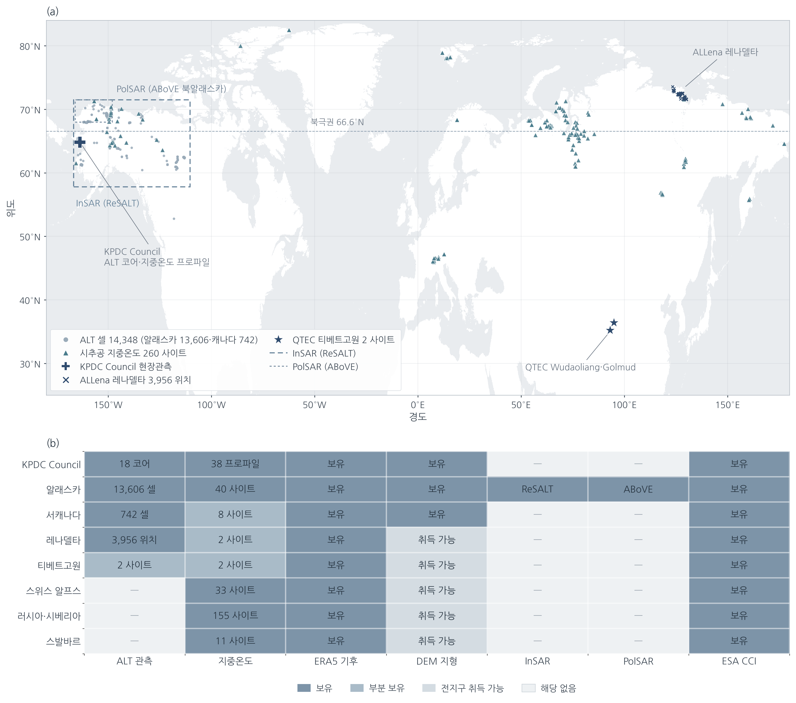
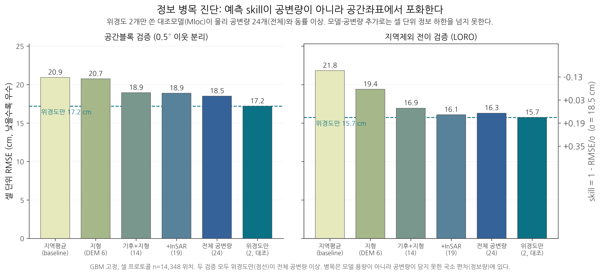
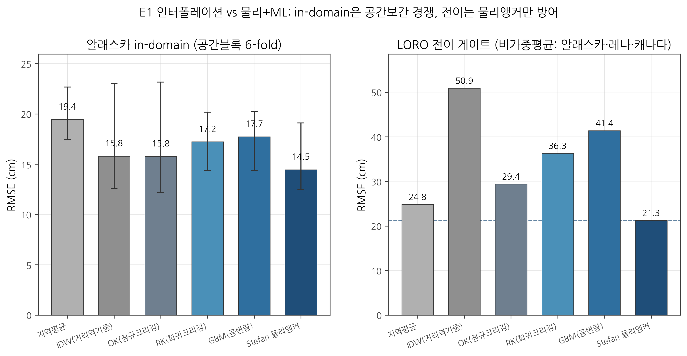
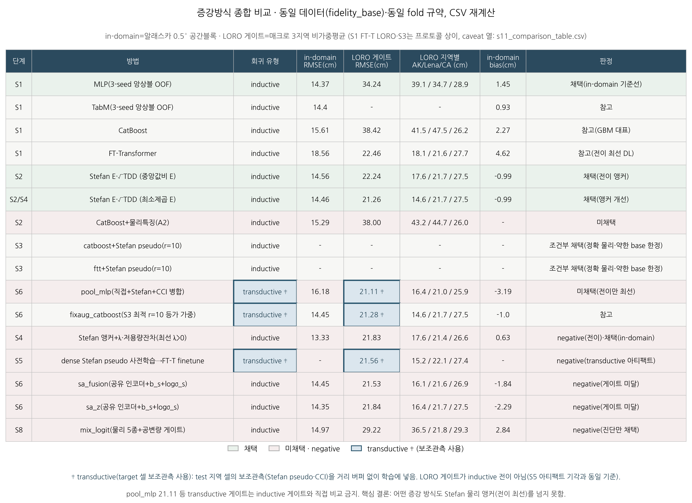
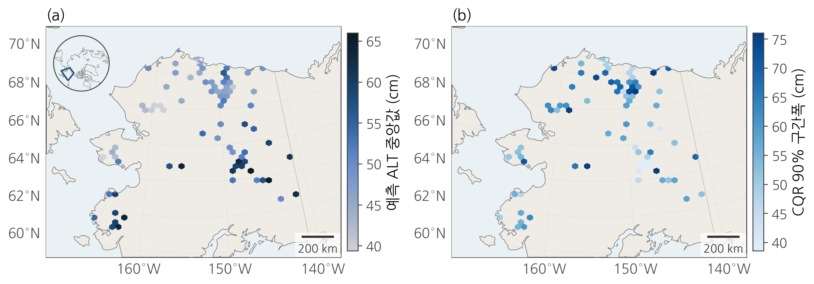
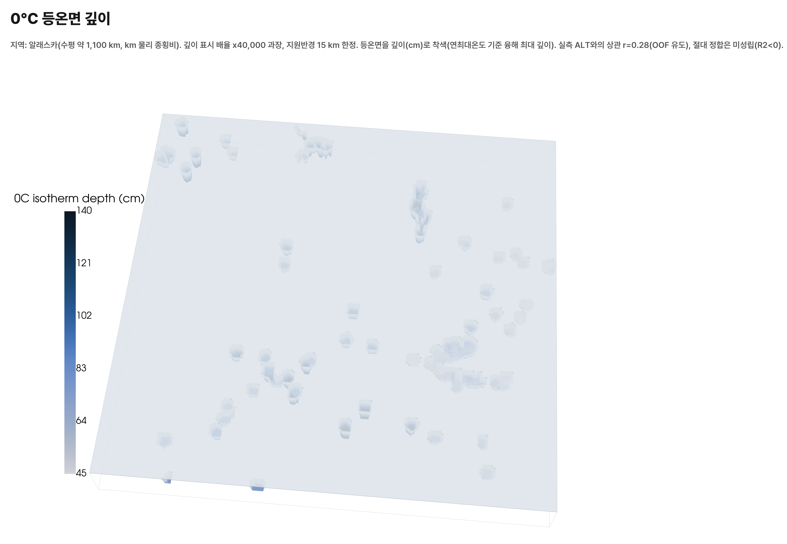
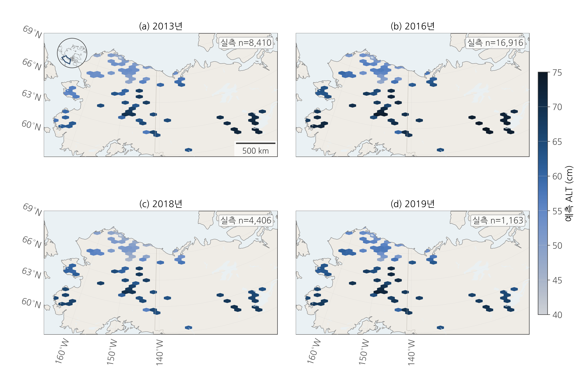
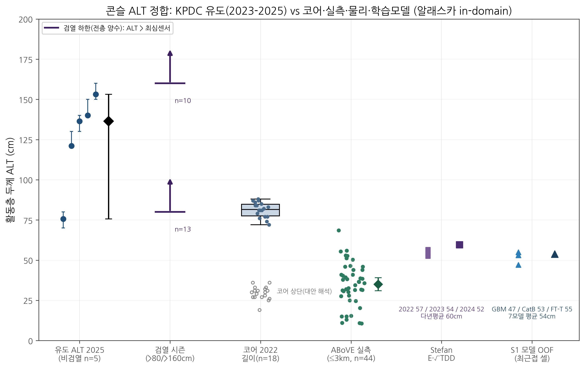

# 관측기반 GeoAI를 이용한 영구동토 활동층 두께(ALT) 예측: 2D 지도·얕은 3D 열구조·전이·보정 불확실성

2026 극지 빅데이터-인공지능 활용 경진대회 예선 분석 보고서

---

## 1. 배경·목표

### 1.1 활동층 두께(ALT)의 의미

영구동토(permafrost) 상부에는 여름에 융해하고 겨울에 재동결하는 층이 있다. 이 계절 융해층의 최대 깊이를 활동층 두께(active layer thickness, ALT)라 한다. ALT는 지반 안정성, 탄소 순환, 수문 순환을 좌우하는 1차 상태변수이다. 활동층이 깊어지면 동결 상태로 격리돼 있던 유기탄소가 분해 가능한 상태로 노출되고, 지반 침하와 열카르스트가 진행된다. 따라서 ALT의 공간 분포와 시간 변화를 정량화하는 것은 극지 기후·환경 감시의 핵심 과제이다.

ALT는 넓은 면적에서 직접 관측하기 어렵다. 현장 조사는 탐침(probe) 또는 시추로 측정하며 공간적으로 희소하다. 이 때문에 희소한 지점 관측과 광역 공변량(covariate)을 결합해 미관측 지역으로 확장하는 통계·기계학습 접근이 표준이 됐다.

### 1.2 목표

본 연구는 관측자료를 1차 근거로 삼는 GeoAI 프레임워크로 다음 네 산출물을 만든다.

- ALT 2D 지도: 지형·기후 공변량으로부터 셀 단위 ALT 예측.
- 얕은 3D 지중 열구조: 지표 0~3 m 온도장과 0°C 등온면.
- 보정된 불확실성(UQ): 각 예측에 통계적으로 유효한 예측구간 부여.
- 전이(transfer) 평가: 알래스카 학습 모델을 타 영구동토 지대(레나델타·캐나다)로 일반화할 때의 성능·한계 규명.

정확도 경쟁 하나만을 목표로 삼지 않는다. 정보병목(무엇이 예측을 지배하는가), 신뢰가능성(어디까지 믿을 수 있는가), 전이 한계를 함께 규명하는 것을 정체성으로 둔다.[^log]

[^log]: 실험 이력·근거 CSV 목록은 `docs/EXPERIMENT_LOG.md`, 확정 상태표는 `SESSION_HANDOFF.md`에 있다.

---

## 2. 데이터·출처

학습·검증에 사용한 자료는 관측 라벨, 공변량, 물리관측, 현장검증(KPDC)의 네 축이다. 통합 스키마는 고유 위치 17,423셀(공변량 코어 34종)로 구성했다.[^schema] 이 중 라벨과 공변량이 모두 유효한 알래스카 셀 13,606개가 in-domain 학습·평가의 기준 표본이다.

[^schema]: `data/processed/fidelity_base.csv`(17,423셀×45열), `data/processed/fidelity_schema_meta.json`, `data/processed/covariate_availability_by_region.csv`.

### 2.1 관측 라벨(ALT)

| 자료원 | 대상·지역 | 규모 | 기간 | 성격 |
|---|---|---|---|---|
| CALM / ABoVE | 알래스카 활동층 탐침·격자 | 약 13,606셀(집계 후) | 다년 | 공개 관측 |
| ALLena(레나델타) | 러시아 시베리아 thaw depth | 3,037셀 | 다년 | 공개 관측 |
| ABoVE 캐나다 | 캐나다 활동층 | 726셀 | 다년 | 공개 관측 |
| GTN-P 지중온도 봉투 | 다지역(러시아·미국·스위스·스발바르 등) | 수십셀 | 다년 | 유도 라벨(심부, 보조) |

관측 ALT 분포는 통합 셀 기준 평균 약 50 cm, 표준편차 약 20 cm, 범위 1~298 cm이며 대부분 알래스카에 편중된다(알래스카 부분집합만 보면 표준편차 약 17 cm). 같은 위치의 반복 관측은 좌표 반올림 단위로 집계해 셀당 1행으로 만들고, 셀평균을 정답, 셀내 표준편차를 불확실성 라벨로 둔다. 위치내 변동은 평균 약 3.8 cm(중앙값 2.0 cm)로 작다.

### 2.2 공변량 14종(모델 입력의 전이-강건 코어)

전이 실험의 공정 비교를 위해 전 지역에서 결측 없이 확보되는 지형·기후 14종을 코어 입력으로 고정했다.

- 지형(DEM 파생) 6종: 표고, 경사, 사면 방위(sin·cos), 지형위치지수(TPI), 거칠기.
- 기후(ERA5-Land 파생) 8종: 연평균기온, 융해도일(TDD), 동결도일(FDD), √TDD, 최난월·최한월 기온, 1층 토양온도, 적설수당량(SWE).

토양(SoilGrids 9종)·InSAR(5종)·PolSAR(3종)·CCI(2종)는 통합 스키마에는 포함하나, 지역별 결측(예: InSAR·PolSAR는 알래스카 외 0%)으로 전이 학습 입력에서는 제외한다.[^avail]

[^avail]: `data/processed/covariate_availability_by_region.csv`. InSAR는 알래스카 100%·레나 0%·캐나다 100%, PolSAR는 알래스카 74%·그 외 0%.

### 2.3 물리관측·산출물(공변량·검증 보조)

- InSAR 침하 유도 ALT, PolSAR 유도 ALT: 알래스카 국한, 면적평균 검증 기준의 후보.
- ESA CCI ALT 제품: 25년 다년평균, 전 셀 부착(관측과 상관 r≈0.53), prior·독립 벤치마크로만 사용.

### 2.4 KPDC 현장자료(주 활용)

대회 요건에 따라 KPDC 자료를 주된 검증·해석 축으로 사용한다. 수어드반도 Council 사이트의 다음 자료를 편입했다.[^s7]

- 콘슬 8~16층 일별 지중온도 프로파일 19종(배치 A·B): 표층 연결 0°C 등온선으로 ALT 유도.
- 코어 thaw depth 18개(2022, SF1-6×C/H/L): 직접 ALT 라벨(코어길이 72-88 cm).
- Council AWS(자동기상관측): ERA5-Land 공변량의 현장 정합 검증.

KPDC 콘슬은 알래스카 in-domain 점검증(최근접 학습 셀 0.97 km)으로 사용하며, 전이 일반화 근거로는 쓰지 않는다.

[^s7]: `data/processed/s7_kpdc_results.csv`, `data/processed/s7_kpdc_meta.json`. 좌표는 파일 내 부재로 문헌 좌표(64.85°N, −163.7°E) 사용.

전 자료원의 지리 분포는 데이터 인벤토리 세계지도로 정리했다.

---

## 3. 방법·해석기법

각 기법의 원리를 간단히 정의한다.

### 3.1 물리 앵커(Stefan)

Stefan 방정식은 활동층 융해를 열전도 문제로 근사해 `ALT = a + E·√TDD` 형태를 준다. `TDD`는 누적 융해도일, `E`는 열·수분 물성을 묶은 계수, `a`는 절편이다. 이 물리식은 지역 간 이동 시에도 온도-깊이 관계가 유지되므로 전이의 하한을 담당한다. 계수 `E`는 각 fold의 학습 표본에서만 추정해(fold-safe) 누설을 막는다.

### 3.2 ML 토너먼트

지형·기후 공변량으로 ALT를 직접 회귀하는 모델군을 비교한다. 트리 부스팅(HistGBM·LightGBM·XGBoost·CatBoost)과 신경망(MLP·FT-Transformer·TabM)을 동일 fold·동일 입력으로 채점한다. 신경망 입력은 fold-safe z-score로 표준화한다.

### 3.3 물리 pseudo-label 증강

타깃 지역(레나·캐나다)에 Stefan 유도값을 pseudo-label로 붙여 학습을 보강하고, 증강 비율 `r`을 스윕한다. 대조군으로 알래스카 평균 상수를 라벨로 붙이는 placebo를 둬서, 개선이 물리 정보에서 오는지 단순 앵커링에서 오는지 분리한다. pseudo/test는 공간블록으로 거리버퍼를 두고 분리한다.

### 3.4 source-aware 다중충실도

자료원별로 관측모델 `y_s = A_s[z] + b_s + ε_s`를 두고 공유 잠재장 `z`, 소스 편향 `b_s`, 소스 분산 `σ_s`를 함께 추정하는 구조(S6)이다. 병합(pooling)과 달리 자료원 신뢰도를 명시적으로 모델링한다.

### 3.5 공간보간(co-kriging / regression kriging)

정통 지구통계 baseline이다. 보통 크리깅(OK)은 변동도(variogram)로 공간자기상관을 모델링해 미관측점을 내삽하고, 회귀 크리깅(RK)은 공변량 회귀 잔차를 크리깅한다. IDW는 거리역가중이다. 물리·ML과 동일 프로토콜로 비교한다(E1).

### 3.6 누설통제

공간자기상관 때문에 무작위 분할은 성능을 크게 낙관한다. 이를 막기 위해 (a) 0.5° 공간블록 GroupKFold(in-domain), (b) leave-one-region-out(LORO, 매크로 지역 Alaska·Lena·Canada 비가중평균 게이트), (c) leave-source-out을 사용한다. 라벨 파생 7종(셀내 SD·min·max 등)은 영구 제외하고, fold-safe Stefan `E`를 강제한다. 이 무결성은 누설방지 단위테스트 16개로 상시 검증한다.[^leak]

[^leak]: `tests/test_leakage.py`(16 passed). `data/processed/s11_multiaxis_validation.csv` 마지막 행.

### 3.7 보정 불확실성(quantile + conformal)

분위 회귀(quantile)로 예측구간을 얻은 뒤, conformalized quantile regression(CQR)으로 학습 블록 내부 보정을 적용해 목표 커버리지를 맞춘다. 원 분위구간의 과신을 후보정한다.

### 3.8 적용가능 영역(AOA)

Meyer의 비유사도지수(dissimilarity index, DI)로 예측점이 학습 공변량 공간에서 얼마나 떨어져 있는지를 정량화하고, DI가 높은 외삽 영역을 표기한다.

---

## 4. 결과: 정확도와 정보병목

### 4.1 in-domain ALT 예측

알래스카 공간블록 검증에서 최상위 모델군은 좁은 대역에 몰린다(3-seed, RMSE cm).[^s1][^s2]

| 방법 | in-domain RMSE(cm) | 비고 |
|---|---|---|
| MLP(앙상블 OOF) | 14.37 | 신경망 최상 |
| TabM(앙상블 OOF) | 14.40 | MLP와 동률(CI 0 포함) |
| Stefan 물리(√TDD) | 14.56 | 물리식 단독 |
| CatBoost | 15.61 | GBM 대표 |
| HistGBM | 약 17.1 | GBM 하위 |

신경망·GBM·물리식이 약 14~16 cm 대역에 모두 들어온다. 모델 교체로 얻는 이득이 seed 잡음 범위 안이므로, 정확도의 병목은 모델 용량이 아니다.

[^s1]: `data/processed/s1_baseline_results.csv`, `s1_baseline_oof.csv`.
[^s2]: `data/processed/s2_physics_results.csv`(p1_stefan spatial_block 14.557).

### 4.2 위경도 대조군이 정보병목을 드러낸다

셀 단위(14,348셀) feature-group ablation에서, 위경도 2피처만 쓴 대조군(Mloc)이 물리 공변량 조합보다 앞선다.[^cell]

| 구성 | LORO RMSE(cm) | skill |
|---|---|---|
| Mloc 위경도(대조) | 15.72 | 0.147 |
| M4 +InSAR | 16.09 | 0.127 |
| M1 기후 | 16.45 | 0.108 |
| M3 기후+지형 | 16.94 | 0.082 |
| M2 지형 단독 | 19.40 | −0.052 |

위도가 기후 이상을 대리하는 것만으로 정교한 물리·SAR 공변량 조합을 넘는다. 이는 현재 공변량이 담는 정보량 자체가 상한이라는 직접 증거이다. 지형 단독은 오히려 악화되는데(9 km 기후 셀에 30 m DEM 정보가 이미 평균돼 미세지형 신호가 희석), 지형이 무관한 것이 아니라 현재 해상도·파생방식에서 정보를 못 담는 것이다.

[^cell]: `data/processed/alt_ablation_cell_results.csv`.

---

## 5. 결과: 전이

### 5.1 순수 ML은 붕괴, 물리 앵커만 전이를 지탱한다

알래스카 학습 후 레나·캐나다로 넘어가는 LORO 게이트(매크로 3지역 비가중평균)에서 순수 ML은 붕괴하고 Stefan 앵커만 하한을 유지한다.[^s2][^s6]

| 방법 | LORO 게이트 RMSE(cm) |
|---|---|
| Stefan 앵커(최소제곱 E) | 21.26 |
| Stefan 앵커(중앙값비 E) | 22.24 |
| CatBoost(직접) | 38.42 |
| MLP(직접) | 34.24 |
| FT-Transformer | 약 22.5 |

트리 부스팅은 알래스카에 과적합돼 전이에서 34~38 cm로 파탄한다. Stefan 앵커는 온도-깊이 물리 관계가 지역 간 유지되므로 21~22 cm 대역을 지킨다. `E` 추정을 중앙값비에서 최소제곱으로 바꾸면 22.24→21.26 cm로 약 1 cm 개선된다.

[^s6]: `data/processed/s6_source_aware_results.csv`, `s11_comparison_table.csv`.

### 5.2 공간보간도 전이에서 붕괴한다

정통 지구통계를 정식 baseline으로 편입했다(E1).[^e1] in-domain에서는 OK 15.77·IDW 15.80이 공변량 GBM 17.73과 경쟁하나(사실상 동률~소폭 우세), 전이에서는 보간이 붕괴한다.

| 방법 | in-domain RMSE(cm) | LORO 게이트 RMSE(cm) |
|---|---|---|
| Stefan(STEF) | 14.46 | 21.26 |
| OK(보통 크리깅) | 15.77 | 29.40 |
| IDW | 15.80 | 50.92 |
| RK(회귀 크리깅) | 17.23 | 36.30 |
| GBM | 17.74 | 41.37 |

전이 붕괴의 원인은 변동도가 지역마다 다르다는 데 있다(range·sill의 지역 편차). 이는 covariate shift의 공간통계판이다. OK의 레나 전이가 겉으로 낮은 것은 실력이 아니라 변동도 range 밖에서 학습 전역평균으로 회귀하는 아티팩트이다.

[^e1]: `data/processed/e1_kriging_comparison_table.csv`, `e1_kriging_variograms.csv`, `e1_kriging_meta.json`.

### 5.3 구조 정교화는 전이를 개선하지 못한다(부정 결과)

source-aware 다중충실도(S6)와 mixture-of-physics(S8) 두 구조를 시험했으나 모두 단일 Stefan 앵커를 넘지 못한다.

- S6 source-aware: 공유 인코더+소스별 (b_s, σ_s)+Gaussian NLL이 LORO 21.53~21.84 cm로 baseline(naive pooling 21.11·앵커 21.26)을 못 넘는다. σ 헤드의 cov90은 0.996이나 구간폭이 473 cm로 발산한 무정보 커버리지이다. 진단 가치는 있다. `b_stefan≈0`은 실제 bias와 정합하고 `b_cci`는 과소추정으로 자료원 식별성 한계를 정량화한다.
- S8 mixture: 물리 5종+공변량 게이트가 LORO 29.22 cm로 단일 Stefan 22.24를 못 이긴다. 정확한 전문가가 Stefan뿐이라(물리 5종 상관 0.89~1.00) 게이트 전환이 오히려 편향 전문가로 이동한다. 알래스카 fold에서 비-알래스카 학습 게이트가 상방편향 전문가를 61% 배정해 36.48 cm로 파탄한다. 이는 전이에서 전문가 선택 불가능성의 정량 증거이다. oracle 하한 15.48 cm는 모델이 아닌 진단값이다.

전이에서 유효한 것은 물리 앵커 직접예측뿐이다.

---

## 6. 결과: 증강 비교분석

증강·구조 6계열을 동일 게이트로 종합 비교했다(S11, 16행 비교표에서 발췌).[^s11]

| 계열 | 방법 | in-domain(cm) | LORO 게이트(cm) | regime | 판정 |
|---|---|---|---|---|---|
| 실측-only | MLP 앙상블 | 14.37 | 34.24 | inductive | in-domain 기준선 |
| Stefan 앵커 | 최소제곱 E | 14.46 | 21.26 | inductive | 전이 앵커(채택) |
| physics-as-feature | CatBoost+물리특징 | 15.29 | 38.0 | inductive | 미채택 |
| 고정가중 증강 | ftt+Stefan pseudo(r=10) | (별도 프로토콜) | Lena 16.5·CA 31.8 | inductive | 조건부 채택 |
| pool(병합) | pool_mlp | 16.18 | 21.11 | transductive | 미채택(전이만 최선) |
| 잔차학습 | Stefan+λ·잔차 | 13.33 | 21.83 | inductive | in-domain 채택·전이 부정 |
| pretrain | dense Stefan 사전학습→FT-T | (별도 프로토콜) | 21.56 | transductive | 부정(아티팩트) |
| source-aware | sa_z | 14.35 | 21.84 | inductive | 부정(게이트 미달) |
| mixture | mix_logit | 14.97 | 29.22 | inductive | 부정(진단만) |

핵심 함의는 세 가지이다.

- 어떤 증강·구조도 LORO 전이에서 Stefan 앵커(21.26)를 유의하게 넘지 못한다. pool_mlp 21.11은 동률이나 in-domain을 파괴하고(16.18) target 셀의 보조관측을 거리버퍼 없이 학습에 넣는 transductive 설계라 inductive 게이트로 비교할 수 없다(S5에서 같은 메커니즘을 아티팩트로 기각한 기준과 일치).
- 증강 이득 대부분은 물리 정보가 아니라 target 앵커링에서 온다. placebo 대조로 순가치를 분리하면, 증강은 정확한 물리·bias 큰 전이·약한 base 모델일수록 순가치가 크다(Canada는 placebo가 −7~−8 악화인데 Stefan은 개선, 물리 필수). 반대로 이미 전이가 강한 base(FT-T)에는 소폭 해가 된다.
- 부정확 물리(Kudryavtsev)를 pseudo-label로 넣으면 `r`을 키울수록 악화된다(Lena·Canada 모두 증강량↑ → 오차↑). 증강 자체가 아니라 물리 정확도가 부호를 결정한다.

in-domain 최저는 잔차학습(Stefan 앵커+λ·저용량 잔차, ridge·λ0.75)의 13.33 cm이다. 다만 이 구조도 전이에서는 λ>0 전 구간이 게이트를 악화시켜(21.26→21.83) 부정 결과이다. 알래스카 fold 파탄이 게이트를 지배하고, inner CV로 λ를 자동 선택하는 것도 불가능하다.

[^s11]: `data/processed/s11_comparison_table.csv`, `s11_multiaxis_validation.csv`.

---

## 7. 결과: 신뢰가능성(UQ·AOA)

### 7.1 보정 커버리지

분위 CatBoost의 원 예측구간은 심하게 과신한다(cov90 44.6%). 학습 블록 내부 CQR 보정 후 목표 커버리지에 도달한다.[^conf]

| 설정 | 90% 커버리지 | 평균 폭(cm) |
|---|---|---|
| raw quantile | 44.6% | 14.7 |
| CQR conformal | 93.4% [88.9, 96.6] | 53.6 |

셀 단위 재분석에서도 raw 56.1%→CQR 85.9%로 같은 방향의 과신 교정이 확인된다. 다만 이 보정은 in-domain 보장이며 전이 커버리지 보장은 아니다(전이에서는 전 방법이 과신).

[^conf]: `data/processed/s11_conformal_results.csv`, `alt_conformal_cell_results.csv`.

### 7.2 AOA와 대표성 하한

AOA DI-구간에서 비유사도가 커질수록 오차가 증가하고(저DI 약 13 → 고DI 약 30 cm) 커버리지가 낮아진다. 외삽 영역을 정직하게 표기한다. 또한 점검증 자체에 대표성 하한이 있다. 단일 탐침 정밀도(약 ±3 cm)와 셀 내 자연 공간변동(툰드라 표준편차 9~12 cm)을 결합하면 약 10~12 cm의 비가역 하한이 나온다. 완벽한 모델도 단일점 평가에서 이 잡음을 없앨 수 없다. 현재 15.7~16.9 cm는 이 하한에 근접한다.

---

## 8. 결과: 얕은 3D·시계열·계절내 D(t)

### 8.1 얕은 3D 온도장

알래스카 0~3 m 실측으로 학습한 GBM 조건장이 온도장을 재현한다(RMSE 2.66°C·R² 0.4688).[^s10] 온도장 검증은 성립하나, 0°C 등온면을 ALT로 환산한 값은 관측과 r≈0.28로 절대정합은 미완이다. 온도장 재현과 ALT 환산은 별개의 검증 단계임을 명시한다.

[^s10]: `data/processed/s10_shallow3d_meta.json`, `outputs/figures/s10_shallow3d/`.

### 8.2 연별 timelapse

재학습 없이 2010-2024 연별 ALT 지도 15장을 연도별 ERA5 forcing×연도별 ALT 라벨로 시간 정합해 렌더했다(정적 다년평균과 구분).[^s9] 연도 홀드아웃(leave-one-year-out) RMSE는 14.97 cm[14.72, 15.22], R² 0.338이다. 그러나 within-site 연 anomaly는 예측 불가하다(corr +0.059 [0.029, 0.088], anomaly skill −0.003). 연도 간 지도 차이는 그해 forcing의 반영일 뿐 위치별 연 변동 예측력이 아니다. 관측 추세는 +1.29 cm/yr이나 R² 0.07로 약하고 연도별 관측 위치 구성 변화의 영향을 받는다.

[^s9]: `data/processed/s9_timelapse_meta.json`, `outputs/figures/s9_timelapse/`.

### 8.3 계절내 융해진행 D(t)

"timelapse에 따른 ALT 계산"을 연도간 최대 ALT 외삽(예측불가)이 아니라 계절내 융해진행 D(t) 예측으로 재정의했다(E2).[^e2] KPDC 콘슬 일별 8~16층 온도(19프로파일·2년)에서 표층 연결 0°C 등온선의 계절곡선을 유도하고, 물리(Stefan √cumTDD)·GRU·persistence·static을 물리위치 leave-out + 시간분할로 비교했다.

- 계절내 D(t)는 예측 가능한 계절 구조를 갖는다(Stefan deepening 구간 R² 0.31~0.57). 이는 연도간 anomaly의 corr 0.06(예측불가)과 대조된다.
- 그러나 common-support·물리위치 fold·보정 제외 통제 후 7일 persistence(공통지지 17.5 cm)가 강baseline이라 Stefan(40.8)·GRU(46.6)는 이를 못 넘는다(2년 소표본·지온 유래 forcing 한계).
- 최대깊이 도달일(EOS)은 단조 물리식으로는 원리적으로 불가하고(argmax가 창 끝에 고정), GRU만 내부 peak를 예측할 수 있다(정확도 우위가 아니라 예측가능성 자체가 차별점).

결론은 시간 성능이 방법이 아니라 문제정의·데이터밀도에 의존한다는 것이다. 정적 공변량과 연 1회 CALM으로 미래연도를 외삽하는 문제는 예측신호가 없고(within-site corr 0.06), 조밀한 일별 지중온도가 있으면 계절내 구조는 예측 가능해진다. 이는 문헌 정합적이다(알래스카 사례에서도 무작위분할 RF R²가 0.84→0.24로 붕괴하는 반면 Stefan은 유지).

[^e2]: `data/processed/e2_seasonal_dt_summary.csv`, `e2_seasonal_dt_eos.csv`, `outputs/figures/e2_seasonal_dt/`.

---

## 9. KPDC 검증

콘슬 지중온도 프로파일에서 표층 연결 0°C 등온선으로 ALT를 유도하고 코어·물리·학습모델과 대조했다(S7).[^s7] 심부 16층 프로파일 배치가 필요해 다수 시즌이 우측검열(right-censored)이므로 구간검열 정량표를 함께 제시한다(38시즌 중 23건 우측검열).

- ERA5-Land √TDD가 콘슬 현장과 정합한다(bias ~0.1). 공변량 backbone의 현장 검증이다.
- 단일 E Stefan은 콘슬을 약 1.7배 과대예측한다. 이는 지역 물성에 따른 E(x) 필요성의 동기이다.
- S1 7모델 평균은 53.8 cm이다. 이는 사이트 관측 스펙트럼(ABoVE 인근 35.0 ↔ 코어 81.3 ↔ 심부 16층 유도 2025 조건부 중앙값 136.4 cm, n=5, CI 75.6-153.1) 내부이나 16층 유도 대비 과소하다.

이 대조가 확인하는 것은 점검증의 대표성 잡음이 지배한다는 것이다. 같은 사이트에서도 관측 방식(탐침·코어·심부 유도)에 따라 35~153 cm로 벌어진다. KPDC 콘슬은 알래스카 in-domain 점검증이며 전이 근거가 아니다.

---

## 10. 한계·로드맵·재현

### 10.1 한계와 로드맵

- 점검증 대표성 한계: 단일점 평가의 약 10~12 cm 비가역 하한 때문에 모델 정교화로 그 아래를 뚫기 어렵다. 다음 지렛대는 면적검증(InSAR 면적평균 기준으로 검증 프로토콜 자체를 전환)과 셀당 다점 평균이다.
- 전이 병목: 병목은 모델 구조가 아니라 covariate shift이다. 레나·캐나다에 라벨을 확보하는 것(target 라벨)이 유일한 실효 지렛대이며, 그 전까지는 물리 앵커+AOA 표기 프레이밍을 유지한다.
- 계절 D(t): forcing을 명시 입력으로 주고, 물리 사전학습·조밀 지중온도를 확충하면 계절내 구조 예측의 여지가 있다(2년 소표본이 현재 한계).
- 공변량 확충: 미세지형 재파생(TWI·다중스케일 TPI·곡률), 지형×기후 교호항, 동적 토양수분·적설 절연항으로 정보병목 완화를 시도한다.

### 10.2 성능의 정직한 포지셔닝

누설을 통제한 정직한 평가에서 본 프레임워크의 in-domain 성능은 물리기반 정직 검증군(문헌 사이트 직접대조 MAE 13~17 cm·RMSE 14~18 cm 대역)과 동일 대역이며 대표성 하한에 근접한다. 최소오차 주장은 하지 않는다. 차별점은 정확도 수치가 아니라 방법론에 있다. 전이 붕괴의 정량 규명(구조 정교화의 부정 결과 포함), 보정 UQ, 얕은 3D, 계절내 D(t)의 예측가능성 구조 분리이다.

### 10.3 재현 정보

- 통합 스키마·누설테스트: `src/polar/fidelity.py`, `tests/test_leakage.py`(16 passed).
- 실측-only 토너먼트: `s1_baseline_results.csv`. 물리 baseline: `s2_physics_results.csv`.
- 증강 반응곡선: `s3_aug_curve_results.csv`(+`_ftt`). 잔차: `s4_residual_results.csv`. 사전학습: `s5_pretrain_results.csv`.
- source-aware: `s6_source_aware_results.csv`. mixture: `s8_mixture_results.csv`. 종합표·UQ: `s11_comparison_table.csv`, `s11_conformal_results.csv`, `s11_multiaxis_validation.csv`.
- 공간보간: `e1_kriging_comparison_table.csv`. 계절 D(t): `e2_seasonal_dt_summary.csv`. KPDC: `s7_kpdc_results.csv`.
- 셀 ablation·UQ: `alt_ablation_cell_results.csv`, `alt_conformal_cell_results.csv`. (전 경로는 저장소 `data/processed/`.)

### 10.4 데이터 출처 재명시

관측 라벨은 CALM/ABoVE(알래스카)·ALLena(레나델타)·ABoVE 캐나다·GTN-P, 공변량은 지형 DEM 파생·ERA5-Land 기후·SoilGrids·InSAR·PolSAR·ESA CCI, 현장검증은 KPDC 콘슬 지중온도·코어 thaw depth·AWS이다. 대회 요건에 따라 KPDC 자료를 주된 검증·해석 축으로 사용했다. 사전학습 모델·생성형 AI 사용 내역과 각 자료원의 라이선스·기간·해상도는 제출 시 별첨 표로 명시한다.
